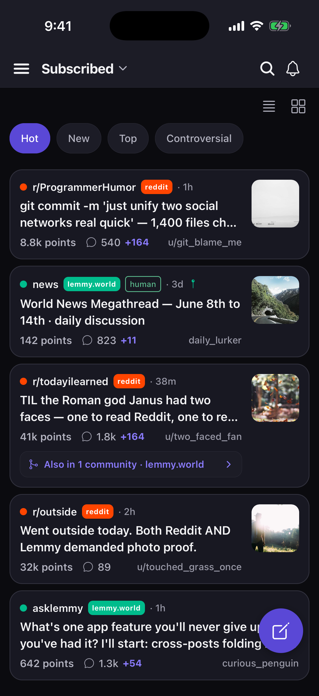
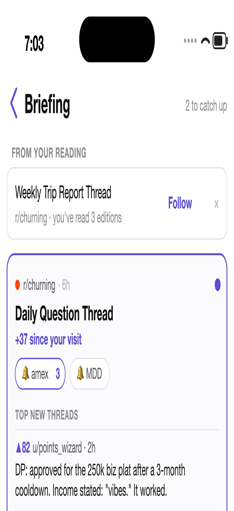
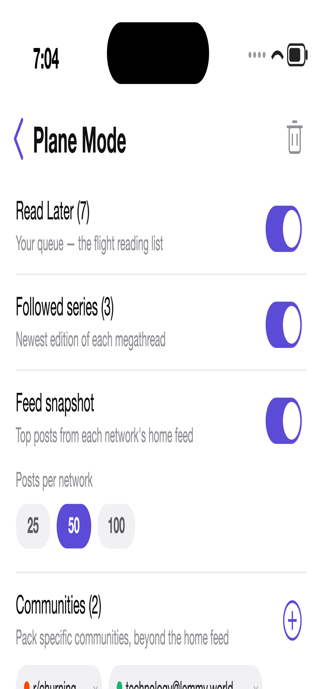

<p align="center">
  
</p>

<h1 align="center">Janus</h1>

A unified iOS client for **Reddit** and **Lemmy** — one polished UI over two
networks. Two-faced god, two platforms.

Janus stands on the shoulders of two excellent AGPL projects:
[**Hydra**](https://github.com/dmilin1/hydra) (whose engineering for
no-API-key Reddit access anchors the Reddit adapter) and
[**Voyager**](https://github.com/aeharding/voyager) (whose Lemmy domain
knowledge informed the Lemmy adapter). It stays AGPL-3.0 in turn.

Janus is a React Native / Expo app built around a single **`SourceAdapter`**
boundary: the entire UI renders one source-agnostic domain model, and each
network is just an adapter behind that interface. The payoff is the things no
single-network app can do — a genuinely merged feed, and reading the same
conversation across both networks at once.

<p align="center">
  
</p>

> The feed interleaves Reddit and Lemmy, tags each post with its origin, and
> folds the same content posted across networks into one card (“Also in 2
> communities”). *(Posts above are illustrative.)*

<p align="center">
  
  &nbsp;&nbsp;&nbsp;
  
</p>

> **Left — the Briefing:** megathread mission control. Each followed series
> resolves today's edition, reports what changed since *your* last visit, and
> surfaces the top new comment threads in place. **Right — Plane Mode:** pick
> the contexts and extent, pack before you board, read fully offline — replies
> queue in an outbox that sends on landing. *(Content illustrative.)*

## Highlights

**Unified, not bolted-together**
- One feed interleaves your Reddit subscriptions and Lemmy communities, with a
  source-balance preference; source is a quiet sigil on each card, not a tribe.
- One model, one composer, one comment renderer: Reddit's nested comments and
  Lemmy's `path`-based comments flow through the **same** tree builder, and both
  feeds render through the same `PostCard`.

**Cross-network features (only possible spanning both)**
- **Repost collapse** — the same link/image posted to several communities across
  both networks folds into one card that carries its companion discussions.
- **Community twins** — standing on `r/technology`, a verified pointer to
  `technology@lemmy.world` (and vice-versa), from a curated map.
- **Merged discussions** — every community's thread about the same content in one
  source-tagged, filterable view.

**Full participation**
- Multi-account: one Reddit account alongside several Lemmy instances at once.
- Vote, comment, post (with drafts + flair), save, subscribe, report, and
  moderate — all routed to the right network per entity.

**Power-user reading**
- **New-comment highlighting** — revisit a thread and everything posted since
  your last visit is badged NEW, with a jump button and a "+N" badge on the
  feed card. Works on Reddit *and* Lemmy threads.
- **User tags** — RES-style private labels ("GPU expert") pinned to any
  handle on either network, shown wherever they appear. Long-press a username.
- **Find in thread** — ⌘F for comments: live match count, next/prev jumps.
- **Live threads** — game-thread mode: comments auto-refresh while you watch,
  arrivals fold in marked NEW.
- **Saved searches (watches)** — pin a query and the app re-runs it on open,
  badging how many results are NEW since you last looked. In-app, no server.
  Two kinds: **post watches** span Reddit + Lemmy together; **comment watches**
  scan inside a megathread *series* (r/churning's Daily Question Thread) for a
  keyword and follow it as the thread rotates day to day — the datapoint feed
  that lives in comments, where post search can't reach. Watch a term right
  from find-in-thread.
- **Followed thread series** — for megathread communities (r/churning's
  "Daily Question Thread", game threads): follow once, and the community feed
  grows a one-tap chip that always opens the newest edition.
- **The Briefing** — mission control for megathread subs: one card per
  followed series with today's edition auto-resolved, what changed since
  *you* last looked (new edition / "+N since your visit"), your keyword
  watches with unseen counts, and the top-scored comments you haven't seen —
  so the big datapoint surfaces even without a watch for it. One polite fetch
  per series; "all caught up" when there's nothing left.
- **Read Later** — a local, account-free queue. Works signed-out, spans both
  networks, and shows how much a thread grew while it waited.
- **Plane Mode** — pack before you board: your Read Later queue, the newest
  edition of every followed series, a snapshot of your home feed, and any
  specific communities you choose — threads, comments *and images* — into the
  caches the app already reads, politely paced. The extent is yours: snapshot
  size, posts per community, text-only packs. Offline is first-class, not a
  downgrade: the pack renders through the normal feed — same cards, gallery
  mode, repost collapse — and votes/replies land in a visible outbox that
  sends on reconnect. Both networks, no server. The same machinery absorbs
  *transient* dropouts — parking garage, tunnel: a streak of
  connectivity-shaped failures flips the app offline even while the radio
  claims otherwise, and the first success flips it back and drains the
  outbox.
- **History** — every thread you've opened, searchable, reopenable on any
  network or instance.
- **Scroll restore** — reopen a long thread and you're back exactly where you
  left off.
- **Saved categories** — RES-style folders over both networks' flat saved
  lists; file anything under "Recipes" or "Churning datapoints".
- **Flair browsing** — communities that use post flair grow filter chips over
  the feed (data-driven; appears wherever flair exists).

**Reading & media**
- Threaded comments with collapse, load-more, per-community sort memory, and
  jump-to-next-comment.
- Native image/gallery viewer, inline video/GIF, and a TikTok-style media reel.
- Community sidebars (about/rules) and a native wiki viewer.

**Fast & polite**
- Slow-changing text (comments, wikis, community sidebars, subscriptions) is
  disk-cached stale-while-revalidate; reopening a thread within the TTL paints
  instantly *and* skips the network. The Reddit transport adds rate-limit
  backoff (429/`Retry-After`) on top, so heavy reading stays gentle on both
  networks.

**Make it yours**
- Custom accent + true-black OLED theming, configurable swipe actions, density,
  hide-seen/hide-NSFW, keyword/community/user filters, iPad split view.

## Architecture

```
janus/
├── core/                 # source-agnostic spine (no Reddit/Lemmy imports)
│   ├── ids.ts            # JanusId codec: canonical id vs federation dedupKey (ap_id)
│   ├── model.ts          # unified Post/Comment/Community/User/Notification/MediaItem
│   ├── adapter.ts        # the SourceAdapter interface every backend implements
│   ├── capabilities.ts   # per-source feature flags (UI gates on these, no faked parity)
│   ├── comment-tree.ts   # one flat↔tree builder + virtualization flatten (both sources)
│   ├── pagination.ts     # opaque cursor (Reddit `after` + Lemmy PageCursor)
│   └── vote.ts  errors.ts
├── sources/
│   ├── reddit/           # RedditAdapter over the web .json API (engineered transport:
│   │                     #   rate-limit, backoff, Retry-After, typed errors)
│   └── lemmy/            # LemmyAdapter over the Lemmy v3 REST API (federation-aware)
├── app/                  # device-local stores (settings, accounts, caches, prefs)
├── ui/                   # the unified UI: theme, AdapterContext, hooks, components, screens
└── entry.tsx             # app entry (builds adapters, mounts the UI)
```

The UI never imports a Reddit or Lemmy client directly — only `SourceAdapter`.
Capabilities are declared honestly, so the UI hides controls a source can't back
rather than faking parity.

## Getting started

```sh
npm install
# Xcode is required. If `xcode-select -p` points at CommandLineTools, prefix with DEVELOPER_DIR.
npx expo run:ios
```

## Develop

```sh
npm test       # jest + @testing-library/react-native
npm run tsc    # strict type-check
npm run lint   # eslint
```

The test suite (400+ tests) covers the ID codec, the comment-tree builder
(including cycle guards), both adapters' mappers and endpoints against fixtures,
the engineered transport's backoff/retry, pagination and cache hooks, the
cross-network engine (twins, repost collapse, deep-link parsing), and UI
components/screens.

## License

Janus is licensed under the **GNU AGPL-3.0** (see [`LICENSE`](LICENSE)). It
derives from AGPL-3.0 projects — [Hydra](https://github.com/dmilin1/hydra) and
[Voyager](https://github.com/aeharding/voyager) — and stays under the same
license.
